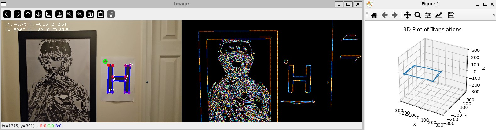

# 11/9/2024 Update
I created this project 7 years ago.  
The code was designed to track a landing pad.  
Looking back on the code, it was hard to follow.  
I have updated the code to improve clarity.  

This project provides a beginners introduction to computer vision symbol tracking.  
There is a focus on simple syntax.  
Comments have been added throughout the code.  
If any step is unclear, raise an issue through github.  

All the code is contained in two files tracker.py and utility.py.  



# OpenCV_Position
This algorithm calculates the position of a camera from a video feed.  
A symbol with known dimensions is extracted from the video and used to calculate a homography.  
The homography is then decomposed into a rotational matrix and translation matrix.  

raw video: https://drive.google.com/file/d/1ll4G2CaEtvSrNik5ZfUfz1ht_5zXz9P7/view?usp=drive_link  
demo video: https://drive.google.com/file/d/14PSAjtRFtcjPG-xEVhOSpgGF2eEPTaoE/view?usp=drive_link   

A complex object with many edges is part of the scene.  
This shows contour filtering is properly working.  

```
Algorithm Steps
   1. Get Frame
   2. Gaussian Blur Grey Scale Image
   3. Canny Line Detection
   4. Contour Detection (OpenCV Detect Contour)
   5. Contour Selection 
      1. 12 Sides
      2. Perimeter Threshold 
      3. Internal Angle Threshold 
      4. Reorder contour points clockwise
      5. Reorder with starting point closest to red circle
   6. Homography From Image to Undistorted Symbol
   7. Remove Camera Matrix
   8. Decompose Homography (Fast Homography Decomposition Zhang)
```

# Different Camera /  Different Symbol ?

I used my phone to capture the raw video.  
I guessed the FOV and camera matrix.  
The phone lens distortion looked minimal and was not accounted for.  

If you use a different camera you will need to calculate the camera matrix.  
opencv has utilities for this: https://docs.opencv.org/4.x/dc/dbb/tutorial_py_calibration.html

Different symbol, this code gives you a foundation, you can figure it out.  

# Python Environment
This project uses uv: https://docs.astral.sh/uv/#python-management  
You can download the raw video from the google drive link provided.  
If you have uv installed, you can run the demo yourself with the following command:  
```
uv run tracker.py -f square_motion.mp4
```
Otherwise, look at the pyproject.toml and install the dependencies manually.  
